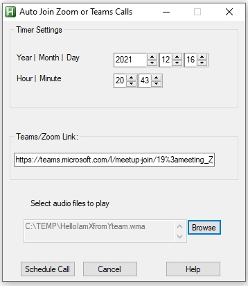

# Auto Join Teams/Zoom at scheduled time

Tool to schedule joining teams/zoom bridges automatically.

## How ?
There are 3 files in the package

#### AutoJoinTeamCallConfig.exe 

Use this to setup the call details, viz. the date-time & the link of the bridge.

The system datetime is used to populate the date-time fields, while the link & file-path from last execution is reused when the application opens. 

You can also optionally specify a file which will be opened soon after you are connected to the bridge.
You good idea would be to provide path of a mp3 file, recorded with message annoucing your presence.

Once you press the **Schedule Call** button, a task would be schedule using a call to SCHTASKS.EXE.

#### AutoJoinCall.exe

This is the supporting application is invoked by **AutoJoinTeamCallConfig** at the scheduled hour.

This application can be terminated by pressing ESC.  It will open the Zoom/Teams link & press the buttons needed to join the call.
Few seconds after the bridge is joined, the file selected using **AutoJoinTeamCallConfig** will be opened.

#### AutoJoinTeamCall.ini

This has 2 sections, the "[Settings]" section stores the values set by **AutoJoinTeamCallConfig**. These are used by **AutoJoinTeamCall** when it gets invoked.

The 2nd section "[History]" section has the log of previous SCHTASKS commands. It is a good practice to clean up this section once a while.

The **AutoJoinTeamCall** application reads the connection details/schedule from this file. The **AutoJoinTeamCallConfig** application writes to this file, it also reads from it to use default values of link & file-path.

## Pre-requisites

1. The teams/zoom links open in browser by default. Ensure your browser is setup to transfer the link to respective applications. 

## Troubleshooting

 As this application uses windows SCHTASKS.EXE to schedule tasks, you can use TASKSCHD.MSC to see logs if there are errors.
 The ini file includes logs of past excecutions for tracking. This can be used to troubleshoot.

## Future Enhancements

The application currently allows setting up just 1 future event at a time. This will be enhanced in later versions.
